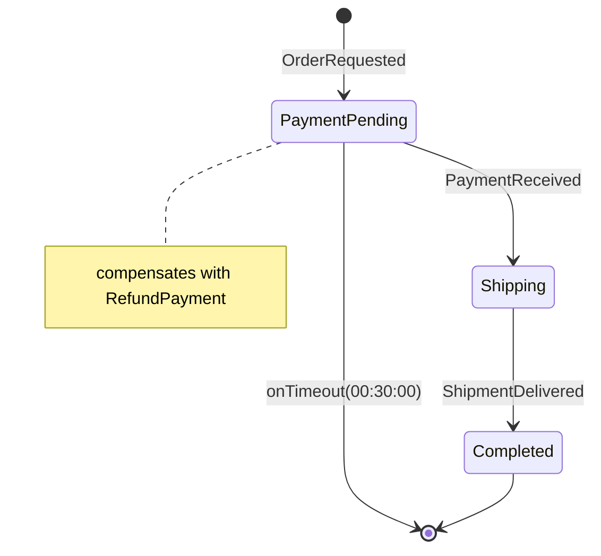

# Saga Guide

Sagas coordinate long-running business processes as a sequence of events and actions with state tracking and compensation.

## Defining a Saga

```csharp
public enum CheckInState
{
    Initial,
    GuestVerified,
    RoomAssigned,
    Completed,
    Cancelled
}

[Saga<CheckInState>]
public partial class CheckInSaga : ISaga<CheckInState>
{
    public Guid Id { get; set; }
    public CheckInState State { get; set; }
    public string CorrelationId { get; set; } = "";
    public DateTimeOffset StartedAt { get; set; }
    public DateTimeOffset? CompletedAt { get; set; }

    // Saga-specific data
    public string? RoomNumber { get; set; }

    [SagaStart]
    public VerifyGuestAction Handle(GuestArrived @event)
    {
        return new VerifyGuestAction(@event.GuestId);
    }

    [InState(CheckInState.GuestVerified, NextState = CheckInState.RoomAssigned)]
    [CompensateWith<CancelCheckInAction>]
    public AssignRoomAction Handle(IdentityVerified @event)
    {
        return new AssignRoomAction(@event.GuestId);
    }

    [InState(CheckInState.RoomAssigned, NextState = CheckInState.Completed)]
    public object? Handle(RoomAssigned @event)
    {
        RoomNumber = @event.RoomNumber;
        CompletedAt = DateTimeOffset.UtcNow;
        return null;  // Terminal -- no further action
    }
}
```

## ISaga\<T\> Interface

```csharp
public interface ISaga<TState> where TState : struct, Enum
{
    Guid Id { get; set; }
    TState State { get; set; }
    string CorrelationId { get; set; }
    DateTimeOffset StartedAt { get; set; }
    DateTimeOffset? CompletedAt { get; set; }
}
```

## Saga Attributes

| Attribute | Target | Description |
|-----------|--------|-------------|
| `[Saga<TState>]` | Class | Marks a saga with state enum |
| `[SagaStart]` | Method | Entry point handler (Initial state) |
| `[InState(state, NextState)]` | Method | Handler for a specific state |
| `[CompensateWith<TAction>]` | Method | Action dispatched on failure (rollback) |
| `[SagaTimeout(Duration)]` | Method | Deadline opened by that step (`"hh:mm:ss"`) |

## SG-Generated Orchestrator

The SG generates `{Saga}.Orchestrator.g.cs` with:
- **State routing**: `switch` on current state + incoming event type
- **Compensation chain**: on failure, dispatches `[CompensateWith]` actions in reverse order
- **Transition validation**: compile-time graph analysis from `[InState]` + `NextState`

### How the next state is decided

`NextState` is the **default** transition: the orchestrator applies it only when the handler did
not set a state itself. A handler that branches (assigning `State` directly) therefore wins:

```csharp
[InState(OrderState.Paid, NextState = OrderState.Shipped)]
public ShipAction Handle(StockChecked e)
{
    if (!e.InStock)
    {
        State = OrderState.Backordered;   // handler decides → NextState is NOT applied
        return null!;
    }

    return new ShipAction(e.OrderId);     // handler stays silent → advances to Shipped
}
```

### Rejecting a message (and triggering compensation)

Compensation is driven by **exceptions**. To reject a message on a *business* ground (and have the
`[CompensateWith]` chain run), throw `SagaRejectedException`:

```csharp
if (!e.IsValid)
    throw new SagaRejectedException("identity verification failed");
```

The orchestrator treats the two failure kinds differently:

| Thrown | Compensation | Final status | Rethrown? |
|--------|--------------|--------------|-----------|
| `SagaRejectedException` | runs | `Compensated` | **No**: a rejection is terminal, the message is not retried |
| any other exception | runs | `Faulted` | Yes: the delivery pipeline retries / dead-letters |

Simply *returning* from a handler never compensates: with no exception the step is a success, and the
saga advances (to the handler's state, or to `NextState`).

## Persistence

By default sagas use an in-memory repository (fine for dev; state is lost on restart). For durable,
EF Core-backed persistence, mark the saga's `[Boundary]` with `[EnableSagaPersistence]`:

```csharp
[Boundary]
[EnableSagaPersistence]   // saga state persists in this boundary's DbContext (__SagaInstances/__SagaSteps)
public partial class BookingBoundary;
```

That single attribute is all it takes: no host-side call. The generator maps the saga tables into the
boundary's DbContext (`OnModelCreating`) and registers `EfCoreSagaRepository<TSaga, TState>` for every
saga in the boundary that implements `ISaga<TState>`, resolving that DbContext at runtime. It requires
the boundary project to reference `Pragmatic.Messaging.EFCore`; without it the attribute is inert and the
generator reports **PRAG0832**.

EF Core persistence uses two tables:

| Table | Purpose |
|-------|---------|
| `__SagaInstances` | Saga state, correlation, timestamps, status |
| `__SagaSteps` | Per-step history; the table is provisioned but not yet written by the repository |

### Delivery semantics (save-before-publish)

Each step runs in this order: invoke the handler, **commit the saga state and next deadline in one atomic
save**, then publish the step's resulting action. Committing first means a crash before the commit can
never emit an action for a saga row that was never persisted, and the state + deadline can never diverge
(they share one transaction).

**Exactly-once with a transactional outbox.** When the saga's boundary also declares `[EnableOutbox]`, the
step's resulting action is **written to `__OutboxMessages` in the *same* transaction as the state** (no
inline publish) and delivered by the outbox pump. The action cannot be lost if the transport fails
after the commit: it is durable in the database and delivered on the next pump poll (at the cost of that
delivery being **asynchronous** rather than inline). This closes the dual-write window. Add `[EnableOutbox]`
alongside `[EnableSagaPersistence]` on the boundary to opt in.

Without `[EnableOutbox]` the action is published inline after the commit (the default above), which is a
deliberate trade-off: if the **transport fails *after* the commit**, the action is not delivered even though
the saga has advanced. That is treated as a **transient** fault: the orchestrator marks the saga `Faulted`
(for visibility; a successful retry resets it to `Active`) and **rethrows for redelivery without
compensating** (a transient blip must not roll the saga back; see Compensation). Make step handlers
**idempotent** and enable **consumer idempotency** (`EnableIdempotency()`) to absorb the duplicate a
redelivery can bring, or use `[EnableOutbox]` for exactly-once.

**Two events for one saga at the same time** (two services acknowledging on two queues) both read the same
version; the one that saves second loses the optimistic-concurrency check with a `SagaConcurrencyException`.
That is not a fault of the step: the orchestrator reads the saga again and runs the event against the state the
other one left, up to five attempts, and never marks the saga `Faulted` for it. The lost save published
nothing (the save comes first) and leaves nothing in the context: no step row, no outbox message. This does
not depend on the transport: the fault path would rely on a redelivery that RabbitMQ without a dead-letter
exchange does not make, losing the acknowledgement and leaving the saga in the state before it.

> Compensator messages are still published inline (not yet routed through the outbox); a transient failure
> while dispatching a compensator is swallowed per-compensator so the rest of the chain still runs.

## Compensation

Compensation runs on a **business rejection** (a step throws `SagaRejectedException`, §*Rejecting a
message*) or a **timeout**, **not** on a transient/unexpected fault (those rethrow for redelivery so a
retry can succeed; compensating on every retry would re-publish the whole chain each time). Each
`[CompensateWith<TAction>]` action is dispatched as a message, so compensating logic is asynchronous and
independently retriable, and one compensator failing never aborts the rest of the chain.

The chain is driven by the **steps that actually executed**, recorded per step in `__SagaSteps` (the
step history) and committed in the same transaction as the state. The orchestrator compensates only
those recorded steps that declare a compensator, in reverse declaration order, so a saga that branched
never compensates a step it never ran (a step that itself was rejected is not in the history, so it is
not compensated either). A repository that keeps no step history falls back to compensating the whole
declaration-order chain.

> Residual: compensators run in reverse *declaration* order among the executed steps, not strictly
> reverse *execution* order; this matters only for a non-linear saga whose compensations are
> order-sensitive across branches. And a redelivered event for an already-terminal saga is ignored only
> because the rejection handler moved it to a terminal state (the recommended pattern); a handler that
> rejects without transitioning could be re-processed on redelivery.

## Timeouts

Put `[SagaTimeout(Duration = "hh:mm:ss")]` on the **step method** that opens the window: the deadline
starts when that step completes and is cleared when the saga advances. A background service polls for
expired instances.

```csharp
[InState(CheckInState.GuestVerified, NextState = CheckInState.RoomAssigned)]
[CompensateWith<CancelCheckInAction>]
[SagaTimeout(Duration = "00:10:00")]   // 10 minutes to receive the next event
public AssignRoomAction Handle(IdentityVerified e) { ... }
```

On expiry the orchestrator runs the compensation chain for the timed-out state and marks the instance
`TimedOut` (the `State` enum itself is left at its last value; `Status` is the terminal signal).

## Diagnostics

| ID | Severity | Message |
|----|----------|---------|
| PRAG0811 | Info | Saga state has no handler (terminal states OK) |
| PRAG0813 | Error | `[Saga<T>]` where T is not an enum |
| PRAG0814 | Error | Saga without `[SagaStart]` |
| PRAG0820 | Error | Saga event has neither `ICorrelatedMessage` nor `[CorrelationKey]` |
| PRAG0821 | Warning | Multiple `[CorrelationKey]` properties on the same event |

## Generated state diagram

For every saga, the SG also emits `PragmaticSagaDiagrams.{SagaName}` (in
`Pragmatic.Messaging.Generated`): a Mermaid `stateDiagram-v2` constant rendered from the same
model the orchestrator enforces, so it can never drift from the code. Paste it into any
Mermaid renderer, embed it in docs, or expose it from a diagnostics endpoint:



Timeouts appear as `onTimeout(duration)` arcs, compensations as state notes, and any state
that is entered but never awaited by an `[InState]` renders as terminal.

## Orchestration vs choreography

`[Saga<TState>]` is **orchestration**: one class owns the whole flow, its state machine is
explicit, compensation is centralized. It shines when the flow has real state to guard
(payments, bookings) and someone will ask "where is this order stuck?".

**Choreography** needs no second engine: it's plain `[MessageHandler]`s reacting to each
other's events. Each service knows only "when X happens, I do Y and publish Z":

```csharp
// Ordering publishes OrderPlaced. Billing reacts, charges, publishes PaymentCollected.
[MessageHandler]
public partial class ChargeOnOrderPlaced
{
    public async Task HandleAsync(OrderPlaced message, MessageContext context, CancellationToken ct)
    {
        var result = await payments.ChargeAsync(message.OrderId, message.Amount, ct);
        // Emit the next fact, or the compensating fact. No orchestrator involved.
        await bus.PublishAsync(result.IsSuccess
            ? new PaymentCollected(message.OrderId)
            : new OrderPaymentFailed(message.OrderId), ct);
    }
}

// Shipping reacts to PaymentCollected; Ordering reacts to OrderPaymentFailed by cancelling.
```

Correlation without implementing interfaces: mark the business key with `[CorrelationKey]`
and every participant (including sagas consuming the same events) correlates on it:

```csharp
public sealed record OrderPlaced([property: CorrelationKey] Guid OrderId, decimal Amount);
```

Choose by asking who owns the flow:

| | Orchestration (`[Saga<T>]`) | Choreography (handlers + events) |
|---|---|---|
| Flow visibility | One class, generated diagram | Emergent: follow the events |
| Coupling | Participants don't know each other; saga knows all | Services know only their triggers |
| Compensation | Centralized, reverse-order chain | Each service emits its compensating fact |
| Adding a step | Edit the saga | Add a handler; nothing else changes |
| Fit | Flows with guarded state and SLAs | Open-ended reactions, cross-team boundaries |

Start with choreography; introduce a saga when you catch yourself re-implementing state
tracking inside handlers.
